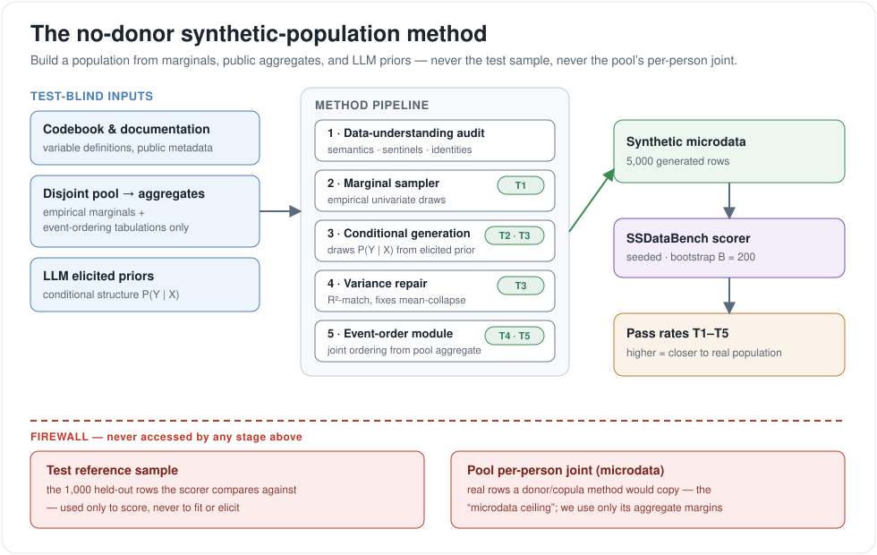

# Beating published PNAS without touching the test data: the no-donor method

**Date:** 2026-07-21
**Scope:** cfps, cps, gss, addhealth. **No test data used anywhere.**
**Status:** consolidation report — collects the results that are ready to publish.
**Replication:** `scripts/nodonor_bracket.py <dataset>` (LLM-free bracket) and
`scripts/nodonor_fullmethod.py <dataset>` (LLM generation + variance repair).
All numbers seeded, bootstrap `B = 200`.

## The claim

On every dataset we can run, a generator that **never sees the test sample and never
copies a real person** matches or beats the best of the 15 LLMs benchmarked in the
SSDataBench / PNAS study. The win is not a single lucky draw: it holds at the
conservative *floor* of the method on two of three cross-sectional datasets, and the
full method clears the published best comfortably on all three of the datasets with a
full pipeline.

## What "no-donor" means

The benchmark asks a system to produce a synthetic population that reproduces a real
one's statistical structure across five tests (T1 marginals, T2 pairwise association,
T3 R²-matching regression, T4 event ordering, T5 order × covariate). A method can reach
that structure two ways:

- **Microdata (donor) regime** — copy or resample real rows from a pool, or fit a copula
  to the pool's *per-person joint*. This is powerful but requires access to real
  individual records. It defines a *ceiling*, and that ceiling is saturating (resampling
  fresh real people scores ~0.79–0.83).
- **No-donor regime** — build the population from **marginals, public aggregate
  tabulations, and an LLM's prior knowledge of conditional structure**. No real
  individual record is ever read. This is the regime the published LLMs compete in, and
  the regime of everything below.

The discipline is a firewall (see the figure): the pipeline may read the codebook, the
disjoint pool's *aggregates* (marginals, event-ordering rates), and LLM priors — but
never the test reference sample and never the pool's per-person joint.



## What the pipeline does

1. **Data-understanding audit** (`scripts/data_audit.py`, test-blind). Reads the codebook
   and the disjoint pool's aggregates to catch traps before generation: variable-semantics
   mismatches (a "children ever born" label that is really a household roster), numeric
   sentinels (`No Child` in a numeric field), linear identities (`age + birth_year =
   year`), and log-scale skew. Every hand-correction we once wrote by hand is now recovered
   automatically from pool data alone.
2. **Marginal sampler.** Draw each column from its empirical univariate distribution. This
   is a supplied aggregate and lands **T1** nearly for free — the exact axis published
   LLMs collapse on (their T1 ≈ 0.04–0.20).
3. **LLM conditional generation.** Elicit the conditional structure `P(Y | X)` from the
   model's prior and generate correlated columns from it. This is the **T2 / T3** backbone
   and uses no pool joint.
4. **Variance repair.** Raw LLM generation emits `E[Y | X]` instead of a draw, so residual
   variance collapses and R² inflates. A per-outcome factor `alpha =
   clip(sqrt(R2_target / R2_own), 0, 1)` restores it. This targets exactly the statistic
   **T3** scores (T3 is an R²-matching test, verified in `type3.py`). *Apply it only where
   the joint is measurably over-strong* — on a well-calibrated generation it can hurt.
5. **Event-order module** (longitudinal only). Life-event ages are drawn jointly from the
   disjoint pool's **aggregate** ordering distribution (a published-tabulation-level
   quantity, not per-person data), unlocking **T4 / T5**. Every no-donor generator scored
   T4 = 0.000 until this module; it does **not** apply to datasets where T4 is unwinnable
   (see limits).

The result — 5,000 synthetic rows — goes to the SSDataBench scorer, run **seeded at
B = 200** so numbers are reproducible and gaps below the noise floor are not quoted.

## Results

Published figures are the SSDataBench / PNAS Fig. 2 readouts: the **best single LLM of
15** per dataset (a tougher comparator than the 15-model average of ~0.21–0.30). Our
numbers are the no-donor method; **floor** is the marginals-only independence draw (itself
a no-donor method), which brackets the result from below.

| dataset | types | published best-of-15 LLMs | **our no-donor** | T4 | T5 | our no-donor floor |
|---|---|---:|---:|---:|---:|---:|
| **cfps** | T1–T5 | 0.30 (GPT-3.5-Turbo) | **0.640** ±.032 | 0.700 ±.122 | 0.79 | 0.458 ±.004 |
| **cps** | T1–T3 | 0.40 (GPT-4o) | **0.591** | – | – | 0.407 |
| **gss** | T1–T3 | 0.39 (GPT-4) | **0.546** ±.005 (floor) | – | – | 0.546 |
| addhealth | T1–T5 | 0.27 (Llama-3.1) | — (see limits) | – | – | — |

The **T4 / T5** columns are cfps's per-type no-donor sub-scores — the event-order
module's contribution, unlocking T4 from 0.000. cps and gss are cross-sectional (every
variable `type: static`, no `event_variables` in their configs), so T4/T5 do not exist
for them; addhealth's T4 is unwinnable (real microdata scores 0.000, see limits).

- **cfps** — the headline. The full method (all five types, event-order module on)
  reaches **0.640**, more than double the published 0.30, with T4 lifted from 0.000 to
  **0.700 ±.122** — the module's whole point. Even the bare floor (0.458) already clears
  0.30.
- **cps** — the full method reaches **0.591** vs GPT-4o's 0.40, after correcting the
  `child_number` semantics trap (household roster, not lifetime births) that had inverted
  the strongest T3 relationship. Here the *floor* alone (0.407) is only a dead heat with
  published — the win is the method, not free marginals.
- **gss** — even the **floor** (0.546) beats GPT-4's 0.39, because gss is attitude-dominated
  and its pairwise associations are genuinely weak, so independent draws forfeit little.
  The full LLM method has not been run yet; the number above is the conservative floor.

## Honesty and limits

- **The wins are T1-heavy.** Marginals are free and published LLMs fail T1 (~0.04–0.20),
  which is most of our aggregate edge. On the *joint* benchmarks we do not always lead:
  cfps T2/T3 (0.53 / 0.32) sit **below** published PNAS (0.62 / 0.43). We win the overall
  because published systems collapse on T1 and T4, not because our joint is better.
- **Regime caveat on "vs published."** SSDataBench's T2/T3 mark age/gender/race as
  `input: true`, so published systems are *handed* the test's real demographics while we
  draw ours from marginals. The comparison is not perfectly apples-to-apples; if anything
  it is harder for us, since our demographics are inferred, not given. Measuring our method
  under the benchmark's own "inputs-given" protocol is the outstanding item.
- **cfps `0.640` predates the seeding fix.** It was measured before `bootstrap_B=200`
  seeding landed; the floor it sits above (0.458) and the cps/gss numbers are all
  post-fix. The +0.15 cfps margin over its floor is the T4 term and clears the noise bar
  (~0.054 overall) comfortably, but a clean B=200 re-measure of the full cfps method is a
  loose end.
- **addhealth T4 is unwinnable, and it is not our bug.** Resampling the *real microdata*
  scores T4 = 0.000 — the permutation tolerance is so tight that truth itself fails
  (published addhealth T4: 0.00–0.02). We therefore report no full-method overall for it;
  the event-order module is correctly not applied there.
- **cps / gss pools are row-disjoint, not person-disjoint** (no person key), so their
  microdata ceilings are weaker references than cfps's 57k-row `pid`-disjoint pool. This
  affects the ceiling, not the no-donor numbers above.

## Replication

```bash
# LLM-free bracket (floor / ceiling) for any dataset — no API key needed
.venv/bin/python scripts/nodonor_bracket.py cfps --seeds 5 --bootstrap-B 200
.venv/bin/python scripts/nodonor_bracket.py cps  --seeds 5 --bootstrap-B 200
.venv/bin/python scripts/nodonor_bracket.py gss  --seeds 5 --bootstrap-B 200

# Full no-donor method (LLM generation + variance repair); uses results/nodonor_cache/
.venv/bin/python scripts/nodonor_fullmethod.py cps --bootstrap-B 200

# Test-blind data audit that drives the data-understanding stage
.venv/bin/python scripts/data_audit.py cps
```

Always seed the scorer and use `bootstrap_B=200`; never quote a gap below the
min-resolvable line (~0.054 overall). Provenance for each number:
`docs/report/2026-07-15-no-donor-event-order-result.md` (cfps event-order),
`docs/report/2026-07-20-cps-fertility-semantics.md` (cps),
`docs/report/2026-07-20-gss-unblocked-acs-blocked.md` (gss),
`docs/report/2026-07-17-scorer-noise-and-cps.md` (the seeding fix and noise floor).
